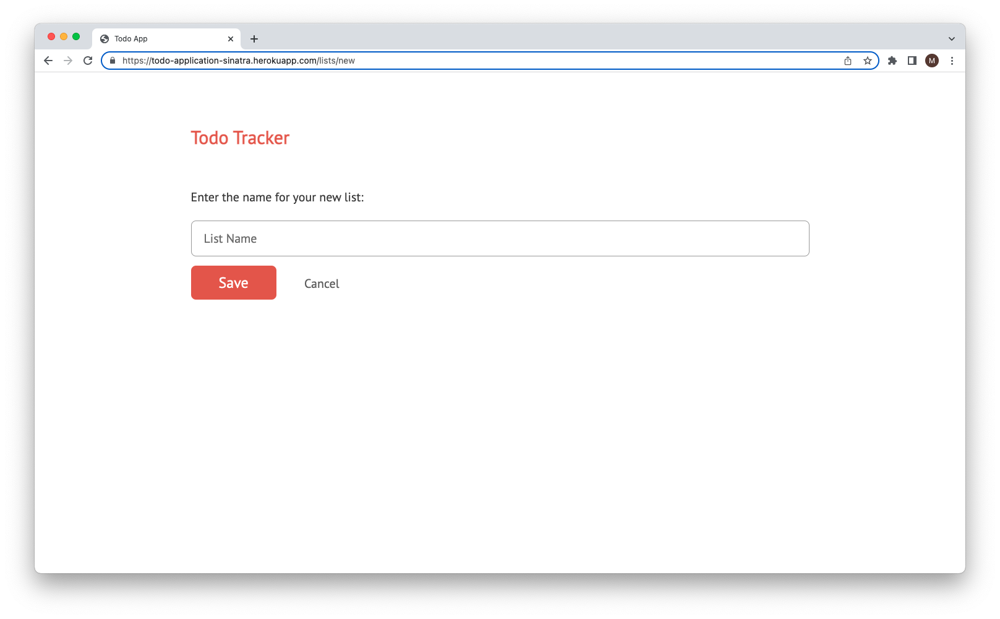
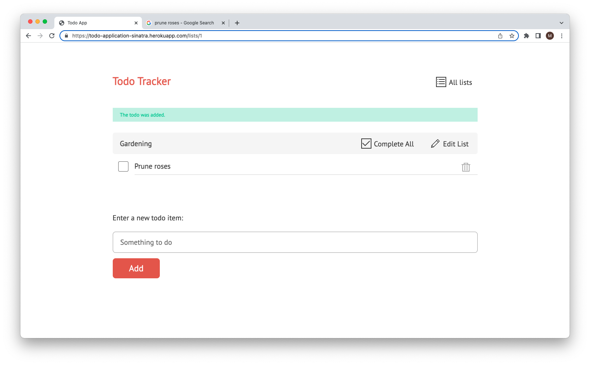

# Todos

A todo application built using `Ruby` and `Sinatra`.

## About

This project's main purpose was to get to grips with `Sinatra`.

## How to use

Try it out [here](https://todo-application-sinatra.herokuapp.com/lists).

### Adding a todo list

### Individual todo list view

